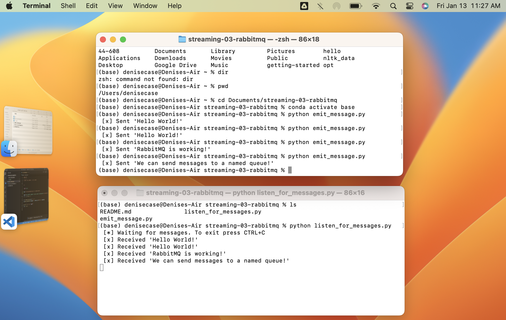

# streaming-03-rabbitmq

Get started with RabbitMQ, a message broker, that enables multiple processes to communicate reliably through an intermediary

## Before You Begin

1. Fork this starter repo into your GitHub.
1. Clone your repo down to your machine.
1. In VS Code with Python extension, click on emit_message.py to get VS Code in Python mode.
1. View / Command Palette - then Python: Select Interpreter
1. Select your conda environment. See the references below for more.
1. Use the terminal to install pika into your active environment. 

`conda install -c conda-forge pika`

## Read

1. Read the RabbitMQ Hello World tutorial
1. Read the code and comments in this repo.

## Execute the Producer/Sender

1. Run emit_message.py

It will run and finish, so we can reuse the terminal.

## Execute the Consumer/Listener

1. Run listen_for_messages.py

Will it terminate on its own? How do you know? 
As long as the process is running, we cannot use this terminal for other commands. 

## Open a New Terminal / Emit More Messages

1. Open a new terminal window.
1. Use this new window to emit more messages
1. In emit_message.py, modify the message. 
1. Execute the script. 
1. Watch what happens in the listening window.
1. Do this several times to emit at least 4 different messages.

## Don't Repeat Yourself

1. Did you notice you had to change the message in two places?
    1. You update the actual message sent. 
    1. You also update what is displayed to the user. 
1. Fix this by introducting a variable to hold the message. 
    1. Use your variable when sending. 
    1. Use the variable again when displaying to the user. 

To send a new message, you'll only make one change.
Updating and improving code is called 'refactoring'. 
Use your skills to keep coding enjoyable. 

## Reference

- [Using Python environments in VS Code](https://code.visualstudio.com/docs/python/environments)

## Multiple Terminals

